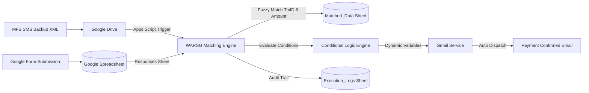

# WARSG (Web-based Automatic Response System Generator)

[](https://react.dev/)
[](https://www.typescriptlang.org/)
[](https://vitejs.dev/)
[](https://developers.google.com/apps-script)
[](LICENSE)

**WARSG** is a Google Apps Script generator designed to automate seminar registration and payment verification workflows. Inspired by [PARS](https://github.com/Jawad-Nahin/PARS), WARSG creates a bridge connecting **Google Forms**, **SMS-based mobile payments** (bKash, Nagad, Rocket, Upay), and **dynamic automated email responses** without third-party webhooks, external servers, or monthly fees.

---

## Architecture & Workflow



1. **Data Collection**: Participants register through a Google Form, entering personal information, contact email, and mobile transaction ID (`$trxId`).
2. **Payment Ingestion**: SMS messages from Mobile Financial Services (MFS) are backed up to Google Drive as an XML dump (via tools like *SMS Backup & Restore*).
3. **Automated Synchronization**: A time-driven Apps Script trigger executes `runFullSync()`, parsing transaction IDs, amounts, and dates from the XML dump into the `SMS_Dump` sheet.
4. **Fuzzy Reconciliation**: The matching engine cross-references form submissions against verified bank/MFS SMS transactions using sanitized TrxID matching and alias-based header detection.
5. **Conditional Evaluation**: Business rules evaluate participant data (e.g., ticket tiering, payment gateway discounts, department checks) to assign dynamic variables.
6. **Email Dispatch**: High-fidelity HTML emails (`Received Template` and `Confirmed Template`) are dispatched via the Google Workspace Gmail service with custom sender aliases.
7. **Audit Logging**: Every synchronization cycle, transaction match, and error is recorded with timestamps in the `Execution_Logs` sheet.

---

## Technical Specifications

### Core Engine
- **Fuzzy Matching**: Implements a two-stage matching algorithm. It first checks exact header aliases across all keys, then safely falls back to partial string matching with built-in safeguards to prevent cross-contamination (e.g., distinguishing between "Student ID" and "Transaction ID").
- **Multi-Parser Regex**: Utilizes customizable regular expressions to extract TrxID and Amount across multiple Mobile Financial Services (MFS) including bKash, Nagad, Rocket, and Upay.
- **Drive Link & ID Normalization**: Automatically extracts raw Google Drive File IDs from full shareable URLs.
- **Time-Based Triggers**: Implements the Google Apps Script Trigger Service to handle periodic synchronization, dynamically optimizing between `everyMinutes()` (1, 5, 10, 15, 30) and `everyHours()` to comply with Google quota limits.
- **Safe Trigger Lifecycle**: Manages triggers idempotently, only resetting WARSG-owned triggers to avoid interfering with other spreadsheet automations.

### Frontend Application
- **Environment**: Built with React 19, TypeScript, and Vite for type-safe and high-performance development.
- **UI Architecture**: Single-page application with a Zed-inspired interface, utilizing PrismJS for syntax highlighting in Dark and Light themes.
- **Zero-JS GPU-Composited Code Editor**: Single GPU-composited container with CSS Grid layering stacks the syntax-highlighted PrismJS layer and transparent textarea in the same cell, ensuring fluid 120/240 FPS scrolling without JavaScript reflow overhead.
- **Floating Email Preview**: Picture-in-picture floating preview window in the right bottom corner with Desktop and Mobile (320px device frame) viewports, maximize/restore toggle, and live simulated data interpolation.
- **Live SMS Tester**: Integrated interactive regex playground to test SMS texts against configured parsers in real-time.
- **HTML Formatter**: Built-in template beautifier with tag-aware 2-space indentation (`Shift+Alt+F`).

## Configuration Guide

### 1. General Settings
- **Event Name**: Title of the event or seminar used in email subjects and templates (`$eventName`).
- **Sender Alias Name**: Display alias that appears in the "From" field of outgoing emails (`$senderName`).
- **Received & Confirmed Subjects**: Customizable email subject lines supporting dynamic variables (e.g., `Registration Received: $eventName`).
- **WhatsApp Link**: Community or seminar invite link injected via `$whatsappLink`.

### 2. Spreadsheet & Sync Settings
- **SMS XML File ID**: Unique Google Drive File ID of the backup XML file (Google Drive share links are sanitized automatically).
- **SMS Sender Filter**: Optional filter (e.g. `bkash`, `nagad`) to ignore non-financial texts in the XML dump.
- **Sync Interval**: Frequency in minutes for background matching runs (1, 5, 10, 15, 30, 60+).
- **Batch Size**: Maximum matches to process per run to stay well within Google's 6-minute execution quota.
- **Custom Sheet Names**: Configure target sheets for Form Responses, SMS Dump, Matched Data, and Execution Logs.

### 3. Variable Mapping
Define project variables with two mapping modes:
- **`Field` Mode**: Dynamically pulls participant responses from Google Sheet columns using comma-separated header aliases (e.g., `Name, Full Name, Participant Name`).
- **`Value` Mode**: Directly assigns static constants or default values (e.g., `Standard Attendee`, `Auditorium A`, `500 BDT`).

### 4. Conditional Rules Engine
Build dynamic branching decision trees directly in the visual editor:
- **Branch Lifecycle**: Root `IF` branch accompanied by `+ Else If` and `+ Else` fallback branches.
- **Dynamic Branch Positioning**: Clicking `+ Else If` automatically splices immediately before the `Else` fallback. The `+ Else` button automatically hides when an `Else` branch exists and reappears if deleted.
- **Dynamic Variable Typing**:
  - Quoted strings (`"..."` or `'...'`) compile and evaluate as explicit strings.
  - Unquoted numbers (`500`, `25.5`, `-10`) compile and evaluate as native numbers.
  - Native booleans (`true`, `false`) are automatically parsed and coerced.
  - Smart numeric coercion prevents JavaScript string concatenation bugs (e.g., `$amount + 50` computes `550`, not `'50050'`).
- **Relational & Logical Operators**: Supports `contains`, `==`, `!=`, `>`, `<`, `>=`, `<=`, and `expr` (custom expression), with multi-condition logic (`&&`, `||`, `!`).
- **Arithmetic Operations**: Direct evaluation of `+`, `-`, `*`, `/`, `%` in variable assignments (e.g., `$amount * 0.1`).
- **Omnipresent Targeting & Autocomplete**: Select any system variable (`$amount`, `$trxId`, `$name`, etc.) or custom variable in condition dropdowns, complete with HTML5 `<datalist>` autocomplete suggestions.

---

## Universal Variable Reference

Use `$variableName` or `{variableName}` anywhere across email templates, subject lines, and conditional blocks:

| Variable | Description | Source |
| :--- | :--- | :--- |
| `$name` | Full name of the participant | Form Response (`Name`, `Full Name`, etc.) |
| `$email` | Contact email address for notifications | Form Response (`Email`, `Email Address`) |
| `$trxId` | Cleaned transaction identifier | Form Response (`Trx ID`, `Transaction ID`) |
| `$amount` | Verified transaction amount | Parsed from bank/MFS SMS |
| `$smsSender` | Name of the matched MFS parser (e.g. bKash, Nagad) | Parsed from SMS |
| `$eventName` | Configured title of the event or seminar | General Settings |
| `$senderName` | Friendly display alias for outgoing emails | General Settings |
| `$whatsappLink`| Group or community invitation URL | General Settings |
| `$[customVar]` | Any custom variable defined in Variable Mapping or Rules | Column alias, static value, or rule output |

---

## Keyboard Shortcuts

| Shortcut | Action | Scope |
| :--- | :--- | :--- |
| `Escape` | Dismiss active modal, restore maximized preview, or close preview | Global |
| `Ctrl + S` / `Cmd + S` | Save project and settings to localStorage immediately (prevents browser dialog) | Global |
| `Alt + P` | Toggle HTML Email Preview (`Show Preview` / `Hide Preview`) | Global |
| `Shift + Alt + F` | Format and beautify active HTML email template | Template Editors |
| `Tab` | Insert 2 spaces indentation at cursor position | Code / Template Editors |

---

## Conditional Rules Example

### Example 1: Tiered Ticket Assignment
```
Rule: in $amount
├── IF >= 1000
│   └── set $ticketTier = "VIP Pass"
├── ELSE IF >= 500
│   └── set $ticketTier = "Standard Attendee"
└── ELSE
    └── set $ticketTier = "General Access"
```

### Example 2: Gateway Surcharge Calculation
```
Rule: in $paymentMethod
├── IF contains "bkash"
│   └── set $processingFee = $amount * 0.0185
└── ELSE
    └── set $processingFee = 0
```

## Deployment & Installation

### Step 1: Prepare Google Spreadsheet
1. Create a Google Form for registrations and link it to a Google Spreadsheet.
2. Open the spreadsheet and navigate to **Extensions > Apps Script**.

### Step 2: Generate & Paste Script
1. In WARSG, configure your event details, variable mappings, conditional rules, and email templates.
2. Click **Copy Code** (or **Download Code.gs**).
3. In the Google Apps Script editor, replace the entire contents of `Code.gs` with the generated script and save (`Ctrl + S`).

### Step 3: Initialize Triggers & Verify
1. From the function dropdown in Apps Script, select **`setupTriggers`** and click **Run**.
2. Grant the necessary Google Workspace permissions (Gmail, Google Drive, Google Sheets).
3. Test your templates by running **`testReceivedEmail`** and **`testConfirmedEmail`**.
4. Your automated seminar response and payment verification system is now live!

---

## Local Development

### Prerequisites
- Node.js (v18 or higher recommended)
- npm or pnpm

### Setup
```bash
# Clone repository
git clone https://github.com/muhammadabdullah007git/WARSG.git
cd WARSG

# Install dependencies
npm install

# Start development server
npm run dev

# Build production bundle
npm run build

# Preview production build locally
npm run preview
```

---

## Security & Privacy

- **100% Client-Side**: WARSG runs entirely inside your browser. All configuration profiles and templates are stored in `localStorage` and never sent to external servers.
- **Google Workspace Native**: Generated scripts execute strictly within your Google Workspace account under your own credentials. No third-party APIs, database connectors, or middleware services are involved.

---

## License

Distributed under the **MIT License**. See [LICENSE](LICENSE) for more information.
